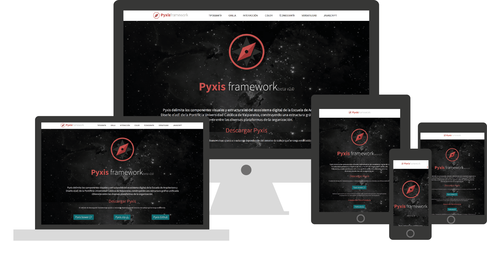

  

    

      <h1 class='rojo fino centrado grande'>Componentes</h1>
      <h5 class='centrado'>Pyxis se articula con diversos elementos , que proponen un entorno de trabajo específico. Los elementos se incorporan para facilitar el uso del framework.</h5>
      

        <i class="icn icn-pc-lig icn-xl"></i> <i class="icn icn-light icn-tablet icn-xl"></i> <i class="icn icn-light icn-movil icn-xl"></i> <i class="icn icn-light icn-pc icn-xl"></i> 
        <h2 class='rojo'>Responsive</h2>
        
Al incorporar una grilla responsiva y adaptable, permite que la construcción de bloques en la diagramación de la página sea fácil y coherente. Esta es la base para lograr una accesibilidad a las plataformas de cualquier dispositivo sin importar su resolución de pantalla.

      

      

         
        <h2 class='rojo'>Less</h2>
        
El uso de less da pie a una mayor parametrización a la hora de configurar las clases gráficas. Además de construir variables y reutilizar sus valores en otros elementos genera una conexión gráfica a lo largo de la plataforma.

      

      

         
        <h2 class='rojo'>Bower</h2>
        
Bower es un manejador de paquetes que garantiza la correcta instalación del framework junto con todas sus dependencias, en este caso jQuery y Stampa. 

      

      

        
        <h2 class='rojo'>OpenSource</h2>
        
El framework al igual que sus dependencias están alojados en github, por ende toda su estructura y elaboración está al libre acceso de cualquier persona, pudiendo tomar partes del framework y extenderlas a su propio deseo.

      

      

                
      

    

  

  

      <h1 class='rojo fino centrado grande'>Fundamentos</h1>
      
En general, con el término framework, nos estamos refiriendo a una estructura digital definida por componentes personalizables e intercambiables para el desarrollo de una aplicación o sitio web. En otras palabras, un framework se puede considerar como una aplicación genérica incompleta y configurable a la que podemos ir añadiéndole constantemente piezas para construir una aplicación concreta.
      Los objetivos principales que persigue un framework son:

      
<i>Acelerar el proceso de desarrollo de un sitio, reutilizar código ya existente y promover buenas prácticas de desarrollo con el uso de patrones o esquemas de diseño.</i> 

      <h3 class='rojo fino centrado'>¿Por qué un framework para la e[ad]?</h3>
      
Las organizaciones, a medida que crecen, van generando nuevos puntos de contacto con sus públicos o audiencias. Hoy día, estos puntos de contacto son múltiples servicios que se traducen en variadas interfaces; tanto materiales como digitales, impresas o proyectadas, grandes o pequeñas, móviles o estacionarias. Mantener un lenguaje consistente a través de todos los servicios y dispositivos se vuelve una tarea titánica si se piensa cada uno por separado. Se hace preciso, entonces, definir un <i>lenguage gráfico global</i> que sea capaz de interpretar la voz de la organización y que se adapte a cada contexto, formato y dispositivo.

      
Este proyecto busca definir fundamentos gráficos elementales para pantallas e impresos cumpliendo las siguientes premisas:

        

        

          <i class="icn icn-xl icn-light icn-lg icn-manoarriba"></i> 
          
Flexibilidad y adaptabilidad para múltiples formatos, dispositivos y modos de interacción (puntero o el dedo)

        

        

          <i class="icn icn-xl icn-light icn-lg icn-lentes"></i> 
          
Marcado semántico en castellano, permitiendo una lectura fácil y natural del código

        

        

          <i class="icn icn-xl icn-light icn-lg icn-sitemap"></i> 
          
Orden y claridad de las funciones de cada archivo de este proyecto, ya que se desarrolla bajo el esquema de <a href="http://lesscss.org/"><i class="icn icn-less"></i> less </a>

        

        

  

  

    <h1 class='rojo fino centrado grande'>Dependencias</h1>
    
Las dependencias de Pyxis Framework son Stampa, Meta (personas), Gamma y AHJVA. Este quiere decir que cada dependencia forma parte de un ecosistema digital donde radica el complemento y alimentación directa entre las mismas, cada una desde su propia ruta en GitHub.

    

      

      <h1 class='rojo centrado'><i class="icn icn-light icn-lg icn-stampa"></i>Stampa</h1>
      <h6 class='rojo centrado'>¿Qué es Stampa?</h6>
      
Stampa es un proyecto centralizado en la iconografía que se complementa con Pyxis. Es una rama de la función del Framework para desarrollar las herramientas de diseño, externalizada en su propio <a href='#'>repositorio</a> y <a href='#'>documentación</a>.

      <h6 class='rojo centrado'>Origen</h6>
      
"Stampa", en italiano, significa: "carattere, indole", lo que en español se traduce como "carácter o índole", referenciando la tipografía y lo iconográfico. 

      <h1 class='centrado rojo'><i class="icn icn-travesia icn-lg"></i> Travesías (en construcción)</h1>
      <h6 class='centrado rojo'>Acerca de la plataformae en proceso de rediseño</h6>
      
El sitio actual de travesías requiere una renovación en cuanto al diseño de interfaz y principalmente lo que sostiene todo el diseño, su arquitectura de información. Existe una lista de parámetros para medir la eficiencia de un sitio, en base a los requerimientos de contenidos y usabilidad actuales. 

      

      

      <h1 class='rojo centrado'><i class="icn icn-light icn-lg icn-noticias"></i>Gamma</h1>
      <h6 class='rojo centrado'>¿Qué es Gamma?</h6>
      
Gamma es una plataforma digital de trabajo colaborativo (específicamente almacenado como repositorio en GitHub), donde se registra el avance de las maquetas navegables para el re-diseño del sitio web oficial de la e[ad] ,previamente investigada como una organización compleja de estructuras en base a una jerarquía y oficio reconocibles en su identidad. Es desde la conceptualización de dicha identidad que Gamma sostiene el proceso constructivo-gráfico ulterior a la arquitectura de información y diseño de Wireframes.

      <h6 class='rojo centrado'>Origen</h6>
      
El nombre del repositorio "Gamma" constituye una referencia directa con la estrella del mismo nombre que forma parte de la constelación "Pyxis", ubicada en el hemisferio sur entre los paralelos 20º a 40º de latitud sur, cerca de la constelación Puppis, muy próxima al ecuador de nuestra galaxia. Es una de las tres estrellas principales de la constelación, junto a las otras dos: Alpha y Beta.
      Esta analogía pretende enlazar de manera creativa los elementos constituyentes del proceso "Atomic-design", donde la identidad se torna relevante si consta formalmente de una imagen coherente y holística (construida metódicamente a través de niveles aesignados) y, en este caso, con un carácter mitológico. 

    

    

  

